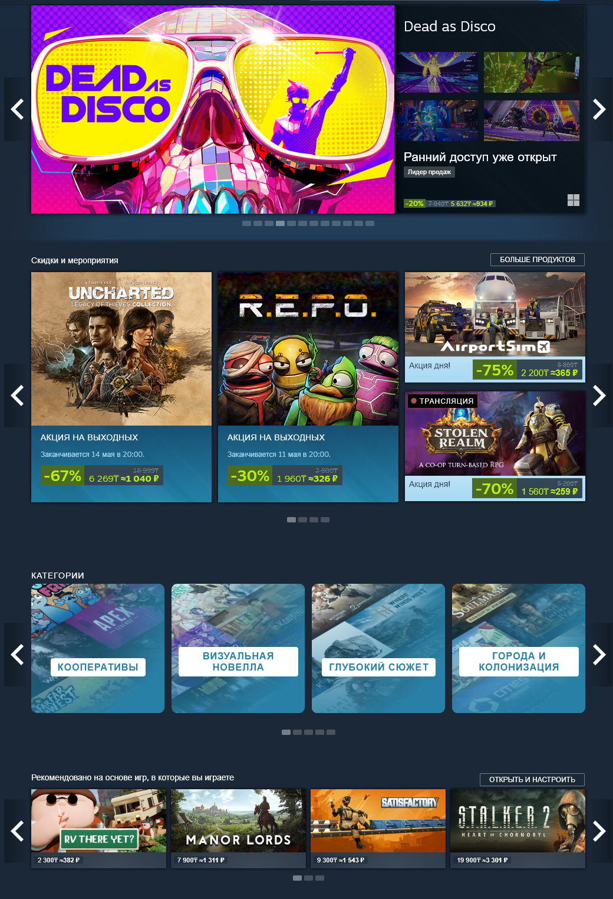
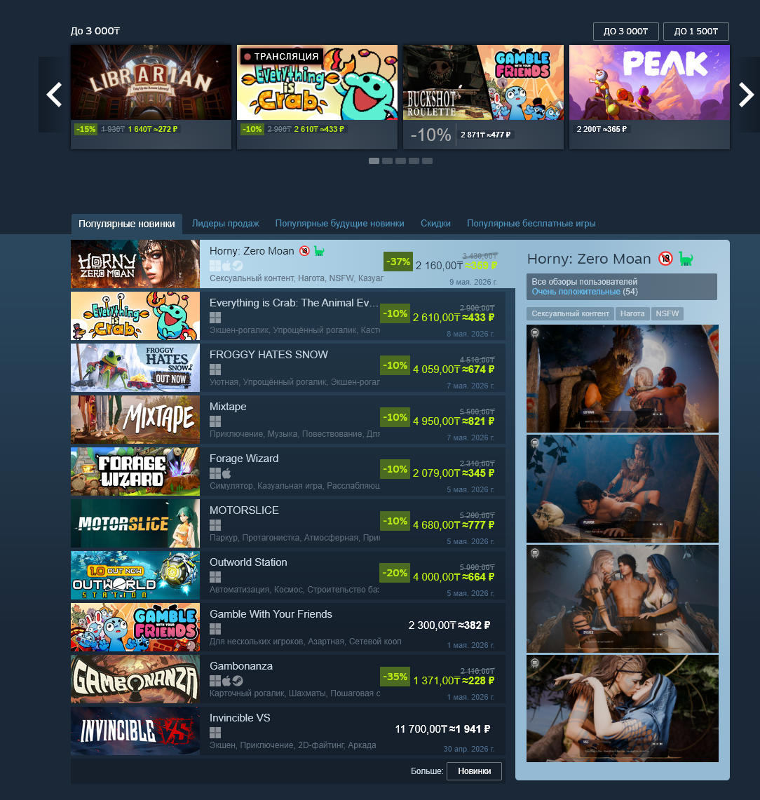
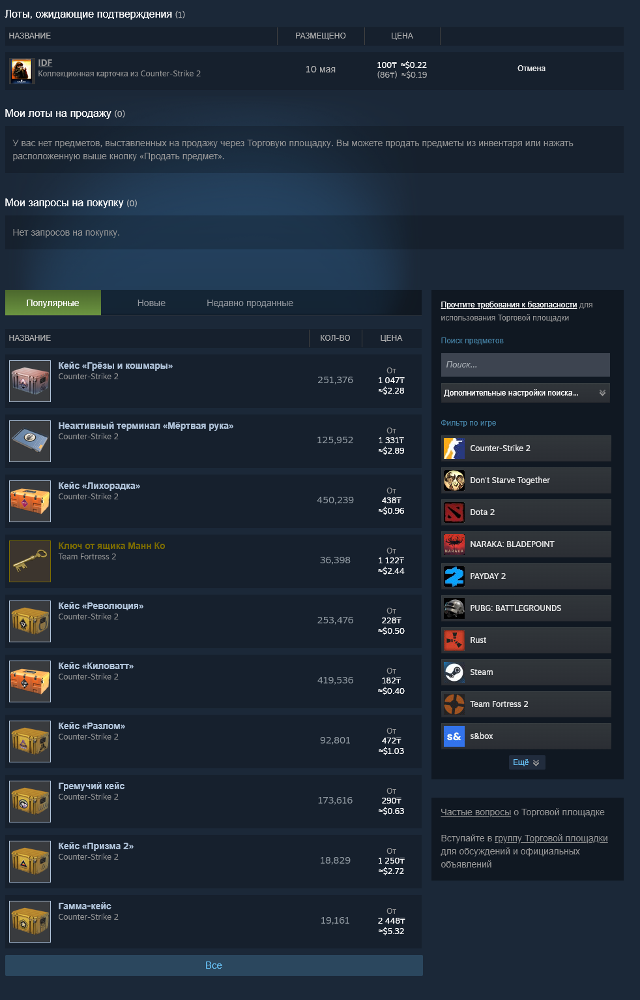

# Steam Currency Converter

Плагин для [Millennium](https://github.com/SteamClientHomebrew/Millennium), который конвертирует цены в клиенте Steam в выбранную вами валюту.

Доступны два источника курсов валют:

- [Freedom Bank (курс мобильного приложения)](https://bankffin.kz/ru/exchange-rates)
- [Free Currency Exchange Rates API.](https://github.com/fawazahmed0/exchange-api)

Целевую валюту можно выбрать в настройках Millennium.

### Требования

- Установленный [Millennium v3.0.0-beta.24](https://github.com/SteamClientHomebrew/Millennium/releases/tag/v3.0.0-beta.24) в клиенте Steam

### Установка
1. Установить Millennium v3.0.0-beta.24 ([ручная установка](https://github.com/SteamClientHomebrew/Millennium/releases/tag/v3.0.0-beta.24) | [автоматическая установка](https://github.com/SteamClientHomebrew/Installer/releases/latest/download/MillenniumInstaller-Windows.exe))
2. [Скачать](https://github.com/Lezhek/steam-currency-converter-millennium-plugin/archive/refs/heads/main.zip) этот репозиторий и разархивировать в папку плагинов Millennium:
   - Windows: `Steam\plugins\steam-currency-converter-millennium-plugin-main`
   - Linux: `~millennium/plugins/steam-currency-converter-millennium-plugin-main`
2. Включить плагин в Millennium и перезапустить Steam.

### Настройка

В настройках плагина можно:

- выбрать источник курсов
- выбрать валюту конвертации
- вручную обновить курсы валют

Курсы обновляются автоматически каждые 30 минут.

## English

A plugin for [Millennium](https://github.com/SteamClientHomebrew/Millennium) that converts prices in the Steam client to your selected currency.

Two exchange-rate sources are available:

- [Freedom Bank (mobile app exchange rate)](https://bankffin.kz/ru/exchange-rates)
- [Free Currency Exchange Rates API.](https://github.com/fawazahmed0/exchange-api)

The target currency can be selected in the Millennium settings.

### Requirements

- [Millennium v3.0.0-beta.24](https://github.com/SteamClientHomebrew/Millennium/releases/tag/v3.0.0-beta.24) installed in the Steam client

### Installation

1. Install Millennium v3.0.0-beta.24 ([manual installation](https://github.com/SteamClientHomebrew/Millennium/releases/tag/v3.0.0-beta.24) | [automatic installation](https://github.com/SteamClientHomebrew/Installer/releases/latest/download/MillenniumInstaller-Windows.exe)).
2. [Download](https://github.com/Lezhek/steam-currency-converter-millennium-plugin/archive/refs/heads/main.zip) this repository and extract it to the Millennium plugins folder:
   - Windows: `Steam\plugins\steam-currency-converter-millennium-plugin-main`
   - Linux: `~millennium/plugins/steam-currency-converter-millennium-plugin-main`
3. Enable the plugin in Millennium and restart Steam.

### Settings

In the plugin settings, you can:

- choose the exchange-rate source
- choose the conversion currency
- manually update exchange rates

Exchange rates are updated automatically every 30 minutes.

## Скриншоты | Screenshots

### Магазин Steam | Steam Store

### Steam Community Market

